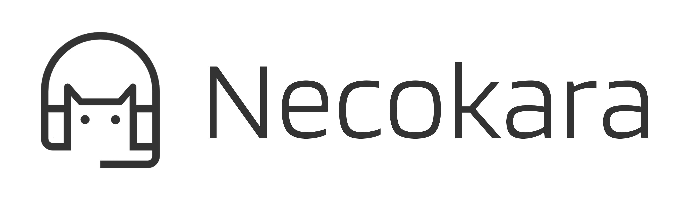

<div align="center">

<a href="README.zh.md">简体中文</a> ｜
<a href="README.zh-TW.md">繁體中文</a> ｜
<a href="../../README.md">English</a>

<br>

<div>


</div>

<br>

<a href="../">ドキュメント</a> ｜
<a href="https://github.com/Chrollis/Necokara/issues">Issues</a> ｜
<a href="https://afdian.com/a/chrollis">Afdian</a> ｜
<a href="mailto:chrollis.phrott@outlook.com">メール</a>

</div>

# Necokara

**ステータス：開発中。**

## クイックスタート

### 一般ユーザー向け

- 正式安定版（main ブランチ）：[Releases](https://github.com/Chrollis/necokara/releases) から入手できます。
- 各リリースには `*_cpu-setup.exe` と `*_cuda-setup.exe` の2種類があります。
- 開発プレビュー版（dev ブランチ）：[Afdian](https://afdian.com/a/chrollis) で提供しています。

### 開発者向け

```bash
git clone https://github.com/Chrollis/necokara.git
cd necokara
npm install

# 最小ランタイムを作成（python embed + pip + ffmpeg → binaries/、packaging 用 binaries/mini も）
npm run create-env
# AI コンポーネントをインストール（デフォルト CPU torch + モデル）
npm run setup-env
# 中国本土のユーザーは：npm run setup-env -- --mirror を使用できます
# ハードウェアアクセラレーション（CUDA）：npm run setup-env -- --cuda

# NSIS インストーラをビルド
npm run build-nsis
```

## 謝辞

AI支援と依存関係の詳細は [ACKNOWLEDGMENTS.md](../../ACKNOWLEDGMENTS.md) を参照してください。

## ライセンス

- プロジェクト：[Necokara License 1.0](../../LICENSE)
- エンドユーザー使用許諾契約：[EULA（日本語）](../eula/EULA_ja.rtf)
- Python ランタイム：`bin/LICENSE.python.txt`
- FFmpeg：`bin/LICENSE.ffmpeg.txt`

## コントリビュート

コードを提出する前に [CONTRIBUTING.md](../../CONTRIBUTING.md) をお読みください。
